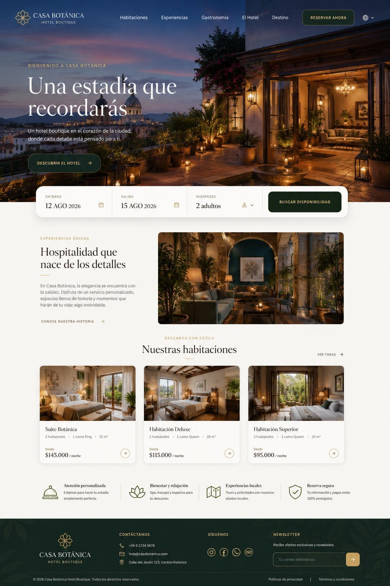
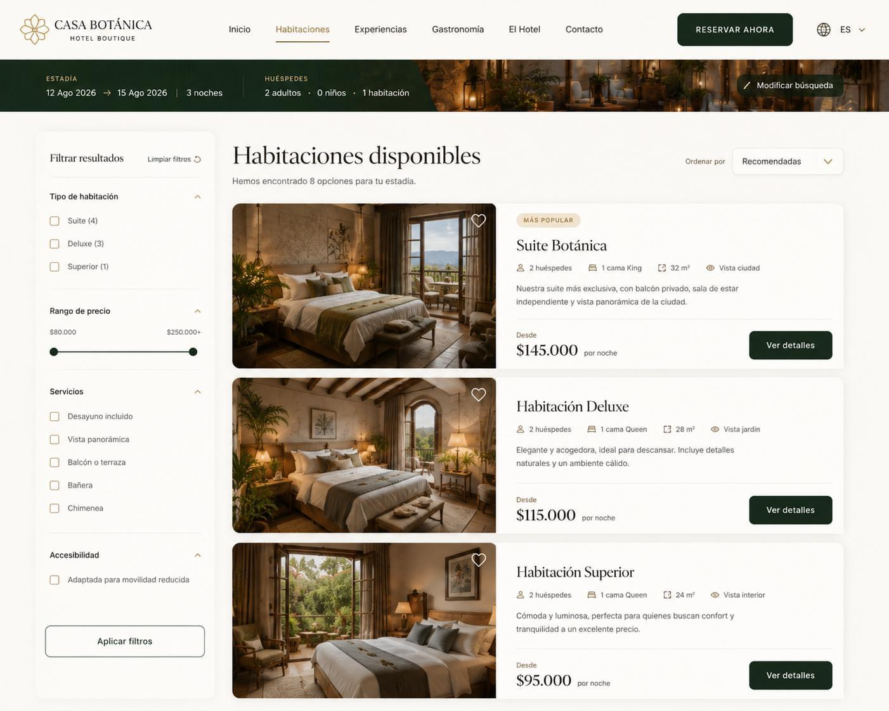
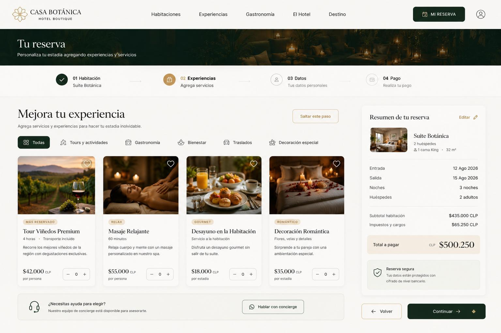

<div align="center">

# Casa Botánica

### Una experiencia digital para un hotel boutique donde naturaleza, diseño y hospitalidad se encuentran.


</div>



## Sobre el proyecto

**Casa Botánica** es una experiencia web responsive para un hotel boutique ficticio. Combina una estética editorial cálida con un recorrido de reserva claro: conocer la historia del hotel, explorar habitaciones, personalizar la estadía, completar los datos del huésped, simular el pago y obtener una confirmación imprimible.

La dirección visual se inspira en la arquitectura mediterránea, los jardines interiores y la hospitalidad pausada. El resultado utiliza fotografía inmersiva, superficies marfil, verdes profundos, acentos dorados y una composición que se adapta a escritorio y móvil.

> Proyecto frontend demostrativo. Los datos, precios y medios de pago son ficticios; no se realizan transacciones reales.

## Experiencia

### Descubrir la casa

La portada reúne la propuesta del hotel, un nuevo apartado **Sobre nosotros**, habitaciones destacadas, experiencias locales y fotografías originales que explican visualmente su identidad y ritual de bienvenida.



### Reservar con claridad

El proceso acompaña al huésped mediante pasos consistentes, un resumen persistente y una navegación diseñada para evitar información duplicada. La confirmación final incluye una boleta profesional optimizada para visualizar e imprimir.



## Funcionalidades principales

- Landing inmersiva con navegación responsive y sección **Sobre nosotros**.
- Galería y recursos fotográficos optimizados en formato WebP.
- Catálogo y detalle de habitaciones con información completa.
- Selector de ambiente y menú sensorial para personalizar la experiencia.
- Cuestionario de confort y acceso rápido a conserjería.
- Selección de experiencias y servicios adicionales.
- Formularios de huésped y pago demostrativo con estado persistente.
- Resumen de reserva consistente durante todo el recorrido.
- Confirmación con número de reserva y boleta profesional para impresión.
- Animaciones sutiles con soporte para `prefers-reduced-motion`.
- Maquetación responsive sin desbordamiento horizontal.

## Recorrido del usuario

```text
Portada y presentación del hotel
   ↓
Catálogo de habitaciones
   ↓
Detalle de la habitación
   ↓
Experiencias adicionales
   ↓
Datos del huésped
   ↓
Pago demostrativo
   ↓
Confirmación y boleta imprimible
```

## Rutas disponibles

| Ruta | Vista |
| --- | --- |
| `/` | Landing, historia, habitaciones y experiencias |
| `/habitaciones` | Catálogo de habitaciones |
| `/habitaciones/suite-botanica` | Detalle de la Suite Botánica |
| `/reserva/experiencias` | Experiencias adicionales |
| `/reserva/datos` | Datos del huésped |
| `/reserva/pago` | Pago demostrativo |
| `/reserva/confirmacion` | Confirmación y boleta imprimible |

## Sistema de diseño

| Elemento | Uso |
| --- | --- |
| Verde bosque `#0D2B22` | Navegación, botones y elementos de confianza |
| Verde profundo `#071C16` | Contraste, fondos y estados destacados |
| Marfil `#F6F3ED` | Fondo principal y superficies cálidas |
| Papel `#FDFBF7` | Tarjetas, formularios y boleta |
| Dorado `#C39A58` | Estados activos, etiquetas y detalles de marca |
| Cormorant Garamond | Titulares editoriales |
| Manrope | Navegación, formularios y contenido funcional |

## Tecnologías

- [Astro 5](https://astro.build/)
- [Tailwind CSS 4](https://tailwindcss.com/)
- TypeScript
- HTML semántico
- JavaScript nativo
- Persistencia local mediante `localStorage`

## Instalación local

Requiere Node.js 20 o superior y pnpm.

```bash
git clone https://github.com/JeanU10/CasaBotanica.git
cd CasaBotanica
pnpm install
pnpm dev
```

El servidor estará disponible normalmente en `http://localhost:4321`.

## Comandos

```bash
# Desarrollo
pnpm dev

# Verificación y compilación de producción
pnpm build

# Previsualizar el build estático
pnpm preview
```

## Estructura principal

```text
public/
└── images/
    ├── about-team.webp
    └── about-ritual.webp
src/
├── components/
│   ├── AtmosphereController.astro
│   ├── BotanicalParticles.astro
│   ├── ComfortQuiz.astro
│   ├── ConciergeModal.astro
│   ├── PublicHeader.astro
│   ├── ReservationSummary.astro
│   ├── SensoryMenuModal.astro
│   ├── Stepper.astro
│   └── StickyBookingBar.astro
├── layouts/
│   └── BaseLayout.astro
├── pages/
│   ├── habitaciones/
│   ├── reserva/
│   └── index.astro
├── scripts/
│   ├── ambianceAudio.ts
│   └── bookingStore.ts
└── styles/
    └── global.css
```

Las imágenes de la sección **Sobre nosotros** fueron creadas específicamente para este concepto y se almacenan localmente para mantener una carga rápida y estable.

## Build de producción

```bash
pnpm build
```

Astro genera el sitio estático optimizado dentro de `dist/`.

---

<div align="center">
  Diseñado y desarrollado como una experiencia conceptual para Casa Botánica.
</div>
